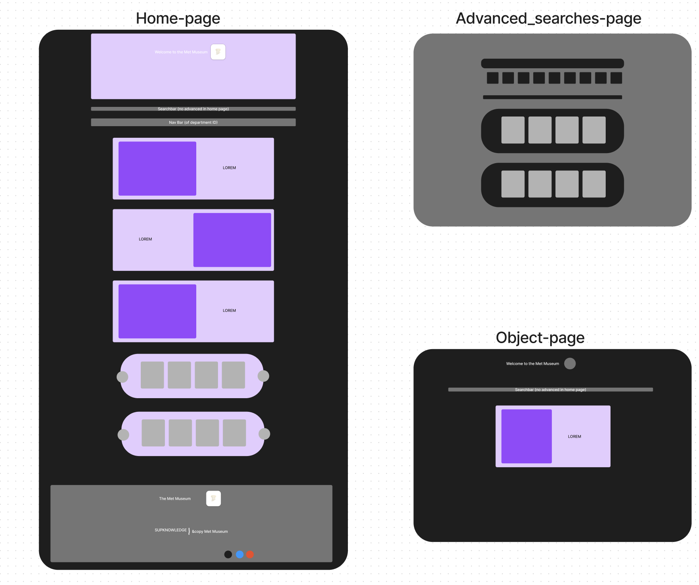

# 2WEBD

## Description
Welcome to our project for developing an interface for the datastore of artifacts and art collection from the MET. This project aims to provide researchers, academics, and users with an intuitive and fast interface to access the MET collections' information.

## Features
- **Quick Search:** A quick search functionality visible on all pages, allowing you to search through all objects in the collections.
- **Advanced Search:** An advanced search functionality on a dedicated page, allowing you to perform specific queries based on multiple parameters (department, date, tags, etc.).
- **Home Page:** Displaying Highlight articles on the main page.
- **Object Detail Page:** A dedicated page to display details of a specific object, accessible through the search bar, advanced search, or other means.
- **Comprehensive Information:** Displaying multiple details for each object (image, name, department, period, author, etc.).
- **Responsive Design:** A responsive design for optimal use on all types of devices.

## Running our project
npm run dev

## API Used
This project uses the MET (Metropolitan Museum of Art) API to fetch collection data. 

## Project Structure
The project is structured as follows:
  
  met-artifacts-interface/
  ├── public/
  ├── src/
  │   ├── components/
  │   ├── providers/
  │   ├── models/
  │   ├── assets/
  │   └── types/
  ├── package.json
  └── README.md
  

## Figma Screenshot

## Contributors
- Robert Enzo
- Le Henanf Loïc
